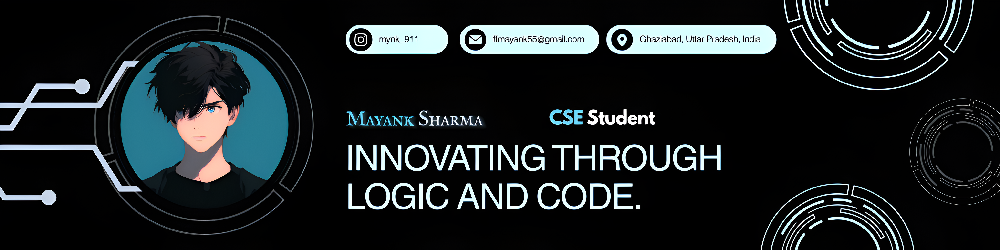

<h1 align="center" style="font-weight:600;">Hi 👋🏻, I'm Mayank Sharma</h1>
<!-- 

 -->

  

  Focused on growth through execution

---

### 🚀 About Me
- 🎓 Computer Science Engineering Student  
- 📍 Ghaziabad, Uttar Pradesh, India  
- 💡 Focused on building strong fundamentals in **DSA + Web Development**  
- ⚡ Consistent learner with a goal-oriented mindset
---

  <table border="0">
    <tr>
      <td bgcolor="#0d1117" align="center">
        <!--  -->
        <h2><b> 💻 Tech Stack</b></h3>
        <a href="https://skillicons.dev">
          
           
          
           
          
        </a>
          
      </td>
    </tr>
  </table>

---

### 🌐 Connect to Me !

 

 &nbsp;
 &nbsp;

 
 

