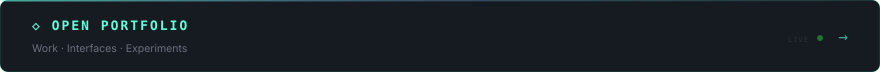
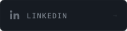
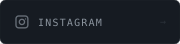
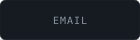

<!-- 
  ┌──────────────────────────────────────────────────────────┐
  │  MAYANK.SYSTEM — Premium GitHub Profile                  │
  │  Regenerate: python scripts/build_profile.py             │
  │  Config: config/profile.json                             │
  └──────────────────────────────────────────────────────────┘
-->

<!-- ════════════════════════════════════════════════════════ -->
<!--  HERO — Application Window                              -->
<!-- ════════════════════════════════════════════════════════ -->

  

<!-- ════════════════════════════════════════════════════════ -->
<!--  CONTRIBUTION TELEMETRY                                 -->
<!-- ════════════════════════════════════════════════════════ -->

  

 

<!-- ════════════════════════════════════════════════════════ -->
<!--  GITHUB STATISTICS                                      -->
<!-- ════════════════════════════════════════════════════════ -->

  

<table>
<tr>
<td width="50%" align="center">
  
</td>
<td width="50%" align="center">
  
</td>
</tr>
</table>

 

<!-- ════════════════════════════════════════════════════════ -->
<!--  TECH STACK                                             -->
<!-- ════════════════════════════════════════════════════════ -->

  

  

<!-- ════════════════════════════════════════════════════════ -->
<!--  CONTRIBUTION FLOW                                      -->
<!-- ════════════════════════════════════════════════════════ -->

  

<picture>
  <source media="(prefers-color-scheme: dark)" srcset="https://raw.githubusercontent.com/YOUR_GITHUB_USERNAME/YOUR_GITHUB_USERNAME/output/github-snake-dark.svg"/>
  <source media="(prefers-color-scheme: light)" srcset="https://raw.githubusercontent.com/YOUR_GITHUB_USERNAME/YOUR_GITHUB_USERNAME/output/github-snake.svg"/>
  
</picture>

  

<!-- ════════════════════════════════════════════════════════ -->
<!--  PROJECTS                                               -->
<!-- ════════════════════════════════════════════════════════ -->

  

<table>
<tr>
<td width="50%" align="center">
  
</td>
<td width="50%" align="center">
  
</td>
</tr>
<tr>
<td width="50%" align="center">
  
</td>
<td width="50%" align="center">
  
</td>
</tr>
</table>

 

<!-- ════════════════════════════════════════════════════════ -->
<!--  CONTACT                                                -->
<!-- ════════════════════════════════════════════════════════ -->

  

  

&nbsp;&nbsp;

&nbsp;&nbsp;

&nbsp;&nbsp;

   

<!-- ════════════════════════════════════════════════════════ -->
<!--  FOOTER                                                 -->
<!-- ════════════════════════════════════════════════════════ -->

 

