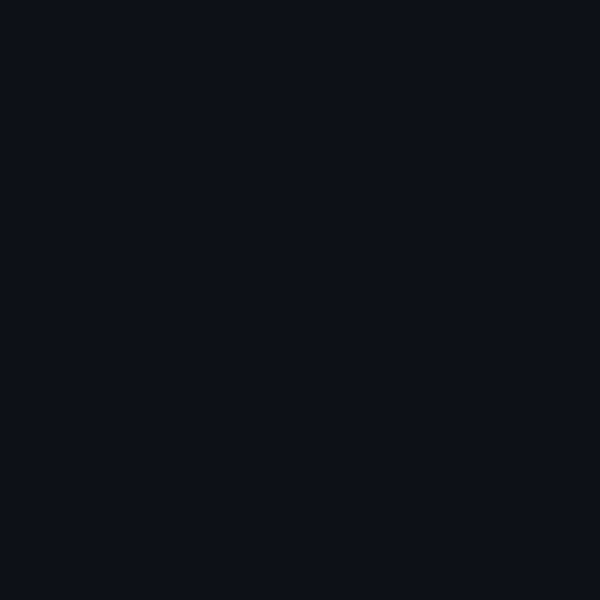
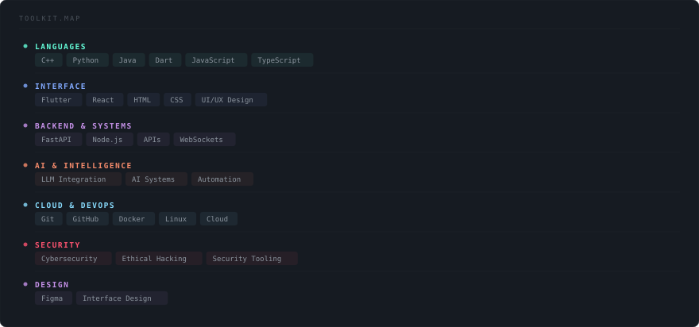
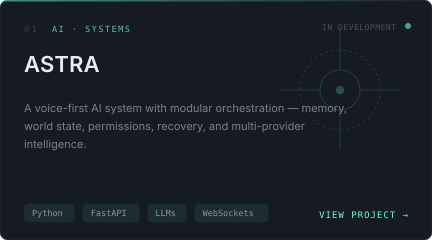
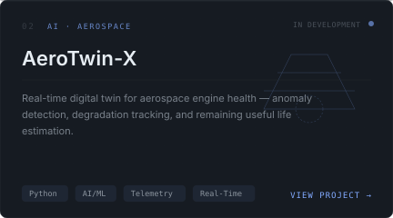
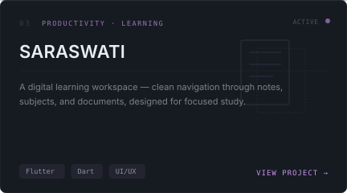
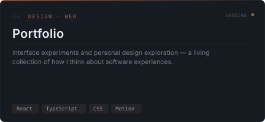

<!-- 
  ┌──────────────────────────────────────────────────────────┐
  │  MAYANK.SYSTEM — Premium GitHub Profile                  │
  │  Regenerate: python scripts/build_profile.py             │
  │  Config: config/profile.json                             │
  └──────────────────────────────────────────────────────────┘
-->

<div align="center">

<!-- ════════════════════════════════════════════════════════ -->
<!--  HERO — Application Window                              -->
<!-- ════════════════════════════════════════════════════════ -->

<table><tr><td>

</td></tr></table>

<!-- Hero — Portrait + Info Panel Composite -->
<table>
<tr>
<td width="310" align="center" valign="top">

<br/>



<br/>

</td>
<td width="570" valign="top">

<br/>

```
 Subject ·················· Mayank Sharma
 Role ······ CSE Student · Builder · UI-Minded Engineer
 Origin ···················· India
 Status ···················· Building
 ─────────────────────────────────────────────
 Focus ········· AI Systems · UI · Cloud · Security
 Building ··················· ASTRA
 Learning ······ DSA · System Design · Cloud Architecture
 Open To ········ Interesting Collaboration
```

<sub>*I build systems that work well and feel right — interested in the space where engineering meets design, from AI orchestration to interface craft.*</sub>

<br/>

<sub>— Quiet execution. Thoughtful systems.</sub>

</td>
</tr>
</table>

<br/>

<!-- ════════════════════════════════════════════════════════ -->
<!--  CONTRIBUTION TELEMETRY                                 -->
<!-- ════════════════════════════════════════════════════════ -->


<br/><br/>

<a href="https://github.com/mykcodes">
  
</a>

<br/>

<!-- ════════════════════════════════════════════════════════ -->
<!--  GITHUB STATISTICS                                      -->
<!-- ════════════════════════════════════════════════════════ -->


<br/><br/>

<table>
<tr>
<td width="50%" align="center">
  <a href="https://github.com/mykcodes
">
    
  </a>
</td>
<td width="50%" align="center">
  <a href="https://github.com/mykcodes
">
    
  </a>
</td>
</tr>
</table>

<br/>

<!-- ════════════════════════════════════════════════════════ -->
<!--  TECH STACK                                             -->
<!-- ════════════════════════════════════════════════════════ -->


<br/><br/>



<br/><br/>

<!-- ════════════════════════════════════════════════════════ -->
<!--  CONTRIBUTION FLOW                                      -->
<!-- ════════════════════════════════════════════════════════ -->


<br/><br/>

<picture>
  <source media="(prefers-color-scheme: dark)" srcset="https://raw.githubusercontent.com/mykcodes
/mykcodes
/output/github-snake-dark.svg"/>
  <source media="(prefers-color-scheme: light)" srcset="https://raw.githubusercontent.com/mykcodes
/mykcodes
/output/github-snake.svg"/>
  
</picture>

<br/><br/>

<!-- ════════════════════════════════════════════════════════ -->
<!--  PROJECTS                                               -->
<!-- ════════════════════════════════════════════════════════ -->


<br/><br/>

<table>
<tr>
<td width="50%" align="center">
  <a href="https://github.com/mykcodes
/astra">
    
  </a>
</td>
<td width="50%" align="center">
  <a href="https://github.com/mykcodes
/aerotwin-x-x">
    
  </a>
</td>
</tr>
<tr>
<td width="50%" align="center">
  <a href="https://github.com/mykcodes
/saraswati">
    
  </a>
</td>
<td width="50%" align="center">
  <a href="https://github.com/mykcodes
/portfolio">
    
  </a>
</td>
</tr>
</table>

<br/>

<!-- ════════════════════════════════════════════════════════ -->
<!--  CONTACT                                                -->
<!-- ════════════════════════════════════════════════════════ -->


<br/><br/>

<a href="https://YOUR_PORTFOLIO_URL"><strong>◆ &nbsp; PORTFOLIO</strong></a>

<br/><br/>

<a href="https://linkedin.com/in/YOUR_LINKEDIN">LinkedIn</a>
&nbsp;&nbsp;·&nbsp;&nbsp;
<a href="https://instagram.com/YOUR_INSTAGRAM">Instagram</a>
&nbsp;&nbsp;·&nbsp;&nbsp;
<a href="https://facebook.com/YOUR_FACEBOOK">Facebook</a>
&nbsp;&nbsp;·&nbsp;&nbsp;
<a href="mailto:your.email@example.com">Email</a>

<br/><br/>

<!-- ════════════════════════════════════════════════════════ -->
<!--  FOOTER                                                 -->
<!-- ════════════════════════════════════════════════════════ -->


<br/>


</div>
